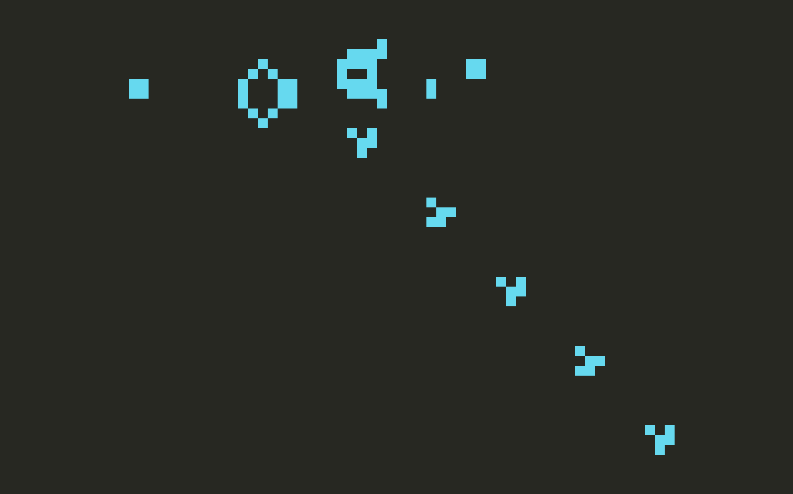

# Conway's Game of Life

Implementation of Conway's Game of Life in C++ with SDL2.

## Usage

1. make sure SDL2 is well configured.
2. `make run`
3. click on screen to make certain cells alive.
4. press space to evolve to next generation.

## Roadmap

- [ ] Read initial generation from file.
- [ ] Going back to previous generation.
- [ ] Border handling.

## Reference

- [Wikipedia - Conway's Game of Life](https://en.wikipedia.org/wiki/Conway%27s_Game_of_Life)
- [TylerBrock/game-of-life](https://github.com/TylerBrock/game-of-life)
- [Rust and WebAssembly - Tutorial: Conway's Game of Life](https://rustwasm.github.io/docs/book/game-of-life/introduction.html)